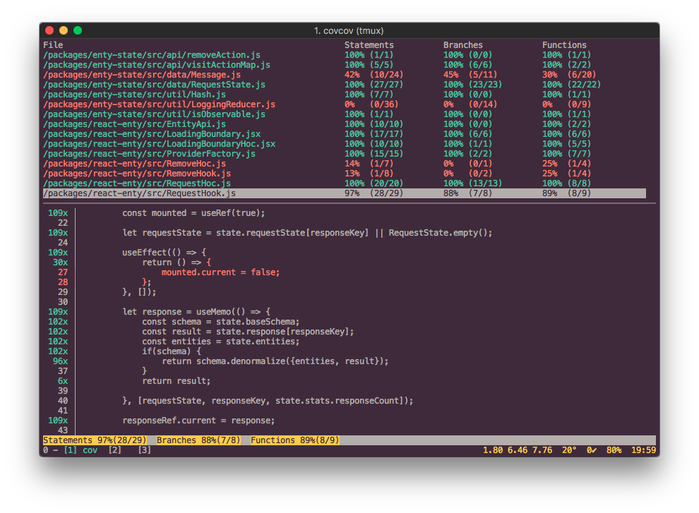

# covcov
A terminal UI for coverage reports.

Covcov recursively searches your working directory for Istanbul coverage reports and 
displays them all in one location.



## Install

```
npm install -g covcov
```


## Usage
Run `cov` or `covcov` in your working directory.  Use arrows or `hjkl` to navigate. `q` to close code view.

```
Usage: cov

Options:
  -V, --version  output the version number
  -h, --help     output usage information

```

